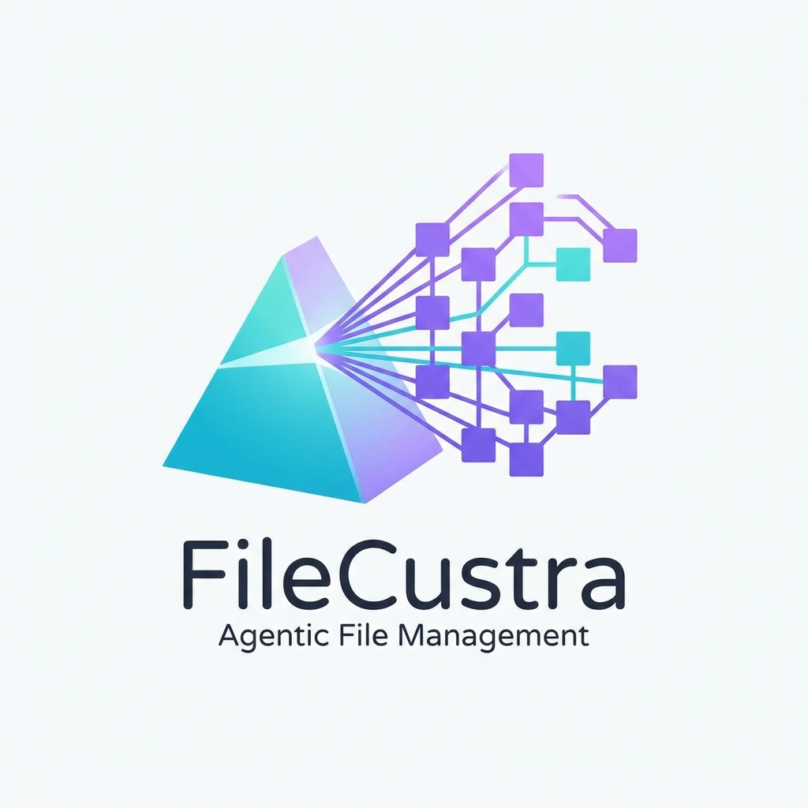

<div align="center">

  

  # FileCustra — Agentic File Management System

  <p><strong>Private-first, offline-capable, cross-platform agentic file management desktop application</strong> built with Tauri 2, React 19, TypeScript, Vite, custom Prism Material design, Rust safe execution core, SQLite FTS5, and a Python 3.10 sidecar for Google Magika, Tesseract OCR, EmbeddingGemma 300M, and local Gemma AI model reasoning.</p>

</div>

---

## Key Features

- **Offline-First & 100% Privacy Lock:** All AI reasoning and file inspections take place 100% locally on your device. Zero file contents, paths, or names leave your system.
- **Tauri 2 Safe Core (Rust):** Deterministic execution core canonicalizes paths, scopes permissions, and enforces dry-run simulation before any file move or rename.
- **Google Magika Content Identification:** Deep-learning file-type identification evaluates raw byte headers/footers rather than fragile file extensions.
- **Selective Tesseract OCR Engine:** Automatically extracts text from scanned PDF documents and image receipts (`PNG`, `JPEG`).
- **EmbeddingGemma 300M Vector Clustering:** Generates 300M dense vector embeddings for semantic search, topic grouping, and duplicate file detection.
- **Gemma ReAct AI Agent (Thought -> Action -> Observation):** Employs Reinforcement Learning (RLHF/RLAIF) and Chain-of-Thought (CoT) reasoning traces across 4 folder topologies.
- **Terminal & Command Control Console:** Provides CLI access (`ls`, `dir`, `magika`, `du`, `stat`, `organize`) scoped strictly to the managed workspace folder.
- **Guided Query 5-Step Interview:** Step-by-step interactive questionnaire to compile custom file organization rules.
- **Write-Ahead Journal & 1-Click Rollback:** Atomic execution logging to SQLite guarantees 100% loss-free reverse undo.
- **Drives Analytics Dashboard:** Displays real-time storage metrics for system drives (`C:\`, `D:\`, `E:\`) and GPU VRAM meters.

---

## Directory Structure

```
FileCustra_Agentic_File_Management/
├── main.py                          # Application orchestrator & launcher script
├── README.md                        # Master project documentation
├── requirements.txt                 # Master Python dependencies
├── .gitignore                       # Git ignore rules for node_modules, build targets
├── frontend/                        # React 19 + TypeScript + Vite + Prism Material UI
│   ├── README.md
│   ├── requirements.txt
│   ├── package.json
│   ├── tsconfig.json
│   ├── vite.config.ts
│   └── src/
│       ├── App.tsx                  # Startup flow & workspace view switcher
│       ├── index.css                # Prism Material CSS design system
│       ├── components/              # Header, Sidebar, PrismRail, Footer
│       └── components/views/        # SplashView, WelcomeView, DriveDashboardView,
│                                    # OnboardingSetupView, HomeView, DiscoveryView,
│                                    # ConstellationView, AutoAiView, TerminalView,
│                                    # GuidedQueryView, OperationPlanView,
│                                    # JournalUndoView, ModelManagerView, SettingsView
└── backend/                         # Python Sidecar + Rust Tauri 2 Safe Core
    ├── README.md
    ├── requirements.txt
    ├── sidecar/                     # Python 3.10 STDIN/STDOUT JSON-RPC 2.0 server
    └── src-tauri/                   # Rust Tauri 2 safe core & SQLite FTS5 database
```

---

## Quick Start Guide

### Prerequisites

Ensure you have the following installed on your machine:
- **Python 3.10+** (or Anaconda / Conda environment)
- **Node.js v20.0+ & npm 10.0+**
- **Rust 1.75+ & Cargo** (for Tauri 2 native builds)

### Installation & Execution

```bash
# 1. Clone the repository
git clone https://github.com/Nitin-Mane/FileCustra-Agentic-File-Management.git
cd FileCustra-Agentic-File-Management

# 2. Install Python dependencies
pip install -r requirements.txt

# 3. Install frontend dependencies
cd frontend
npm install
cd ..

# 4. Launch the application orchestrator
python main.py
```

The application launcher will:
1. Verify system environment dependencies (`Node.js`, `npm`, `Rustc`, `Python`).
2. Spawn the Python 3.10 sidecar backend process over STDIN/STDOUT JSON-RPC.
3. Launch the Vite frontend dev server at `http://localhost:1420`.

---

## Application Startup Flow

1. **5-Second Animated Loading Screen (`SplashView`):** Checks GPU VRAM, SQLite database migrations, and Python sidecar IPC.
2. **Welcome Screen (`WelcomeView`):** Highlights 100% offline privacy guarantees and read-only analysis principles.
3. **Drives Analytics Dashboard (`DriveDashboardView`):** Displays storage capacity meters for `C:\`, `D:\`, `E:\` drives, GPU VRAM gauge, and File Management launch section.
4. **One-Time Onboarding Wizard (`OnboardingSetupView`):** Downloads local AI model weights (Magika, EmbeddingGemma 300M, Gemma 4 E2B IT). *One-time process only.*
5. **Formatted Main Workspace (`App`):** Full access to Discovery, Auto AI ReAct Planner, ReAct Terminal Console, Guided Query, Dry-Run Plans, and Journal Undo.

---

## Technology Stack

| Layer | Technology | Function |
|---|---|---|
| **Desktop Shell** | Tauri 2 | Cross-platform, permission-isolated desktop shell |
| **Frontend UI** | React 19 + TypeScript + Vite | Prism Material CSS, responsive component layout |
| **Privileged Core** | Rust | Path canonicalization, SHA-256/xxHash, dry-run simulation |
| **Database** | SQLite + FTS5 | Local transactional database, full-text search, Write-Ahead Journal |
| **Content Classifier** | Google Magika | Deep-learning content-based file MIME identification |
| **OCR Subsystem** | Tesseract OCR | Offline text extraction from scanned PDFs and images |
| **Vector Engine** | EmbeddingGemma 300M | 300M vector embeddings for semantic search & clustering |
| **AI ReAct Agent** | Gemma 4 E2B IT | Reinforcement Learning (RLHF/RLAIF) & CoT topology reasoning |
| **Edge Runtime** | LiteRT-LM / llama.cpp | GPU/DirectML/CPU local inference execution |

---

## Engineering Framework

FileCustra follows the SOLID framework across the React frontend, Python sidecar, and Tauri/Rust core. The working standard is documented in [`docs/SOLID_FRAMEWORK.md`](docs/SOLID_FRAMEWORK.md).

Key rules:
- UI components stay section-focused and data-driven.
- Runtime system data is loaded through typed service contracts.
- Real local snapshots and fallback snapshots satisfy the same interfaces.
- Planning, dry-run preview, execution, journaling, and rollback remain separate responsibilities.
- Machine-specific generated files stay out of GitHub.

---

## License

Private Project — All Rights Reserved.
